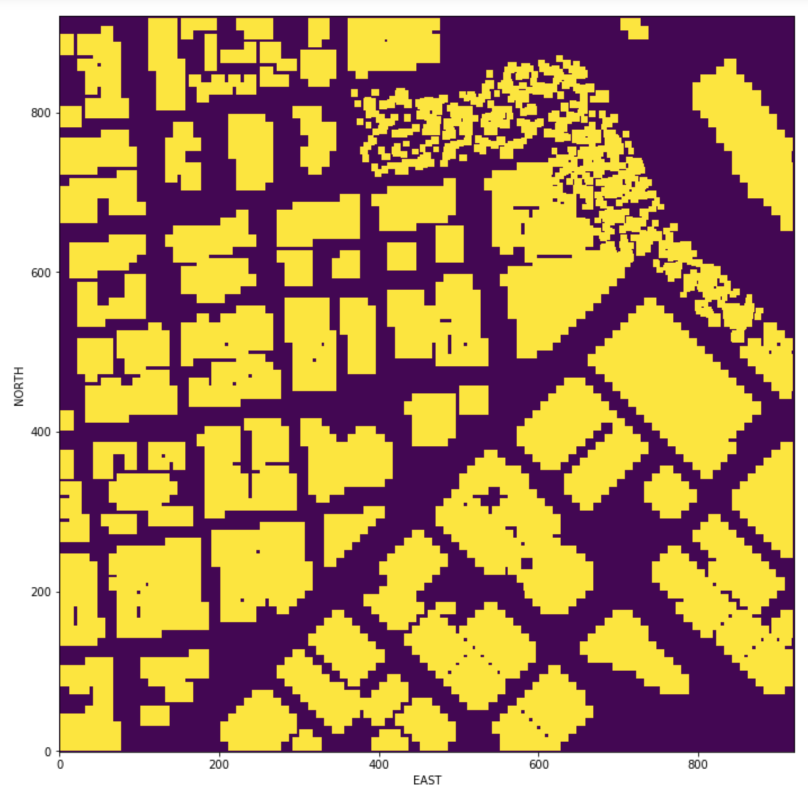

## Project: 3D Motion Planning

---

# Required Steps for a Passing Submission:
1. Load the 2.5D map in the colliders.csv file describing the environment.
2. Discretize the environment into a grid or graph representation.
3. Define the start and goal locations.
4. Perform a search using A* or other search algorithm.
5. Use a collinearity test or ray tracing method (like Bresenham) to remove unnecessary waypoints.
6. Return waypoints in local ECEF coordinates (format for `self.all_waypoints` is [N, E, altitude, heading], where the drone’s start location corresponds to [0, 0, 0, 0].
7. Write it up.
8. Congratulations!  Your Done!

## [Rubric](https://review.udacity.com/#!/rubrics/1534/view) Points
### Here I will consider the rubric points individually and describe how I addressed each point in my implementation.  

### Explain the Starter Code

#### 1. Explain the functionality of what's provided in `motion_planning.py` and `planning_utils.py`
* There is one more State (planning).

* In the funtion local_position_callback(), when the drone is in the State TAKEOFF, we do not calculate the waypoint, because now, we calculate it in the PLANNING State.

* The function state_callback have one more state than before, PLANNING, So now, after ARMING we do not TAKEOFF the drone, we do the PLANNING state before TAKEOFF the drone.

* We do not have the function calculate_box now.

* Now, when we do arming_transition, we do not set the home position in the initial position of the drone inside the function.

* We do not define the target_altitude in the function takeoff_transition, we do now in the plan_path function.

* In this new code, we have two new function:
  - send_waypoint: send waypoints to sim (this is just for visualization of waypoints)
  - plan_path: there is where we calculated the path. Here, we define the target_altitude and the safety_distance. Then, we   read the file collider to create the grid. After calculate the grid, we calculate the path with the A* algorithm. We calculate the waypoints with this path, and finally we send the waypoints to sim. 

Here's the grid of my simulation!

Here's | A | Snappy | Table
--- | --- | --- | ---
1 | `highlight` | **bold** | 7.41
2 | a | b | c
3 | *italic* | text | 403
4 | 2 | 3 | abcd

### Implementing Your Path Planning Algorithm

#### 1. Set your global home position

We don't want that the home position was the started position of the dron, the drone needs to be able to star planning from anywhere.

Fist, we read the firt line of the csv file to set the global drone home position. After read that, I set it to home position with self.set_home_possition()

You can find it in [line 124](motion_planning.py#L124) of `motion_planning.py` and [line 161 to 168](planning_utils.py#L161-L168) of `planning_utils.py`.

#### 2. Set your current local position

the drone need to be able to takeoff from anywhere but the starter code assumed the drone takes off from map center.

With the drone's current position in geodetic coordinates from self.global_position, and the global home position set from last step from self.global_home, We use the global_to_local() function to convert the current global position to local position.

I did this in [line 130](motion_planning.py#L130) of `motion_planning.py`.

#### 3. Set grid start position from local position

The starter code hardcoded the map center as the start point for planning. To further enhance the flexibility to the start location, I changed this to be the current local position in line 142 to 144 of motion_planning.py.

I change the code to take the current local position of the drone as the start point. I did it in [line 141 to 143](motion_planning.py#L141-143) of `motion_planning.py`.

#### 4. Set grid goal position from geodetic coords

In this step, like before, I take a latitude and longitude that the user chose, and then I use the global_to_local function to get the local position in the grid.

I did it in [line 145 to 153](motion_planning.py#L145-153) of `motion_planning.py`.

#### 5. Modify A* to include diagonal motion (or replace A* altogether)

To modify this I needed change tow things.

* First, the cost inside the class Action, to add the cost of the diagonal movements. You can find this in [line 58 to 61](planning_utils.py#L58-L61) of `planning_utils.py`.

* Second, in the valid_actions function, I added 4 more if conditions to check the new states. That's in [line 91 to 98](planning_utils.py#L91-L98) of `planning_utils.py`.

Here's you can see in the first image the old function with rectangular movements and the seconds image with the new function with diagonal movements 

#### 6. Cull waypoints 

### Execute the flight
#### 1. Does it work?
It works!

### Double check that you've met specifications for each of the [rubric](https://review.udacity.com/#!/rubrics/1534/view) points.
  
# Extra Challenges: Real World Planning

For an extra challenge, consider implementing some of the techniques described in the "Real World Planning" lesson. You could try implementing a vehicle model to take dynamic constraints into account, or implement a replanning method to invoke if you get off course or encounter unexpected obstacles.

